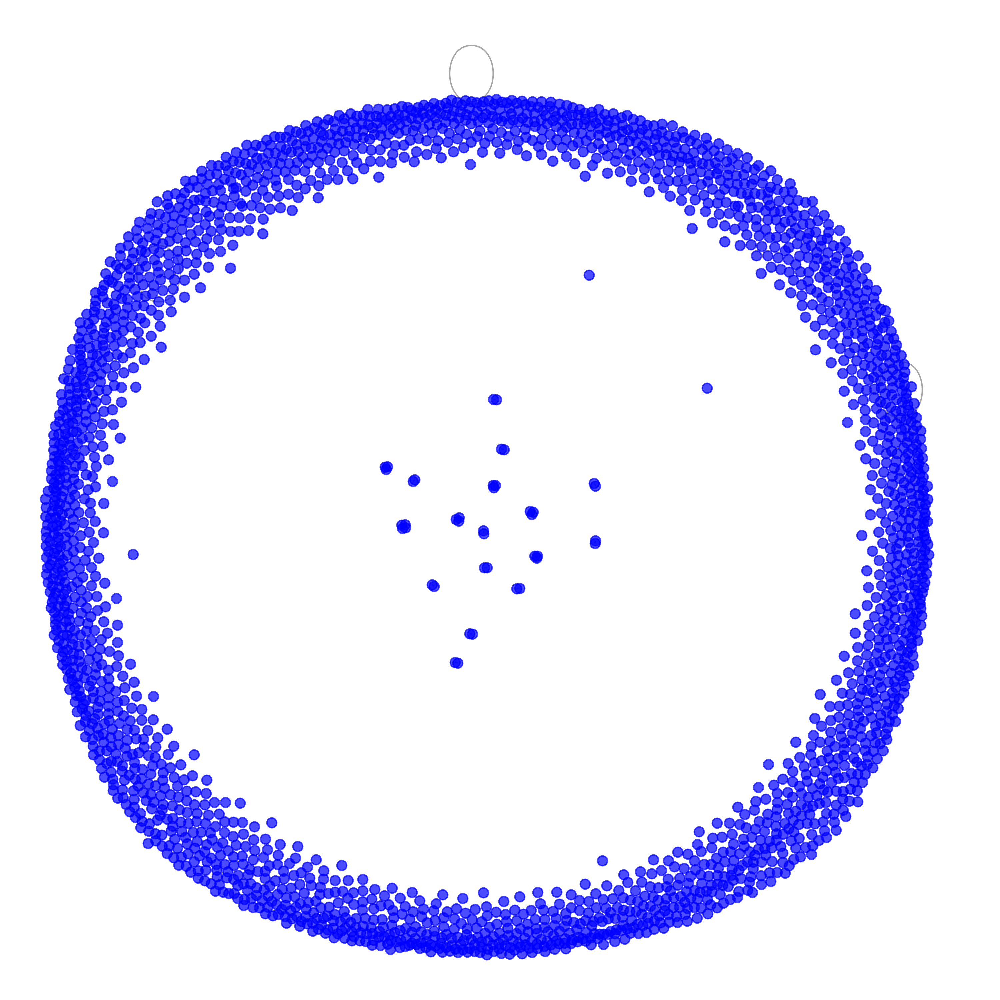

# Instagram Face Deection Algoritm

## Usage

```
python3 scrape.py
```
Inside this file you can adjust from which page scrape photos/videos and how many to install

```
python3 detect.py
```
This file will go thruogh images, create embeddings, form graph, and return you the most popular person in this dataset, and visualisation of graph



And show you the most popular person


## Testing dataset
This dataset consists of 200 images and here is the link to Google Drive:
https://drive.google.com/drive/folders/1OF5GDOl4z0K_t4jFZy7QtOTU-d8KSiWQ?usp=sharing
